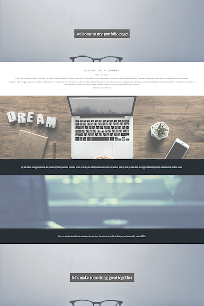

# 02-Advanced-CSS-Portfolio-First

## Description 
I see this as an ever evolving project.  
I wanted to make a profile page to showcase my projects and creativity. My motivation is to be different and more creative than the next student. Standing out.  
During this project I used different elements by looking up new ways to create them.  Debugging often and starting over if needed.  
I learned a lot durning this project and hope to continue evolving the page as I learn more throughout my time in this boot-camp course. In doing this profile page, I realized home much you can do using different tools on the web; there are so many was to be creative.  

## Table of Contents
* [Features](#Features)
* [Installation](#installation)
* [Questions](#Questions)
* [Usage](#usage)
* [License](#license)
* [Badges](#Badges)

## Features
- Span element
- Media query
- Target Link
- Adjusting an image with-in HTML
- Imaging links

## Installation 

NO installation required you can view the page. If you want to look at my code, do a git clone or my repository. 

# Questions
## GitHub User name 
[Link to GitHub](https://github.com/jmnfire)

[Link to website](https://jmnfire.github.io/02-Advanced-CSS-Portfolio-First/index.html)

[Link to repository](https://github.com/jmnfire/02-Advanced-CSS-Portfolio-First)

### Email 
jovan.m.nixon@gmail.com

## Usage

## License 

MIT License
Copyright (c) 2021 Jovan Nixon
Permission is hereby granted, free of charge, to any person obtaining a copy
of this software and associated documentation files (the "Software"), to deal
in the Software without restriction, including without limitation the rights
to use, copy, modify, merge, publish, distribute, sublicense, and/or sell
copies of the Software, and to permit persons to whom the Software is
furnished to do so, subject to the following conditions:
The above copyright notice and this permission notice shall be included in all
copies or substantial portions of the Software.
THE SOFTWARE IS PROVIDED "AS IS", WITHOUT WARRANTY OF ANY KIND, EXPRESS OR
IMPLIED, INCLUDING BUT NOT LIMITED TO THE WARRANTIES OF MERCHANTABILITY,
FITNESS FOR A PARTICULAR PURPOSE AND NONINFRINGEMENT. IN NO EVENT SHALL THE
AUTHORS OR COPYRIGHT HOLDERS BE LIABLE FOR ANY CLAIM, DAMAGES OR OTHER
LIABILITY, WHETHER IN AN ACTION OF CONTRACT, TORT OR OTHERWISE, ARISING FROM,
OUT OF OR IN CONNECTION WITH THE SOFTWARE OR THE USE OR OTHER DEALINGS IN THE
SOFTWARE.

## Badges

